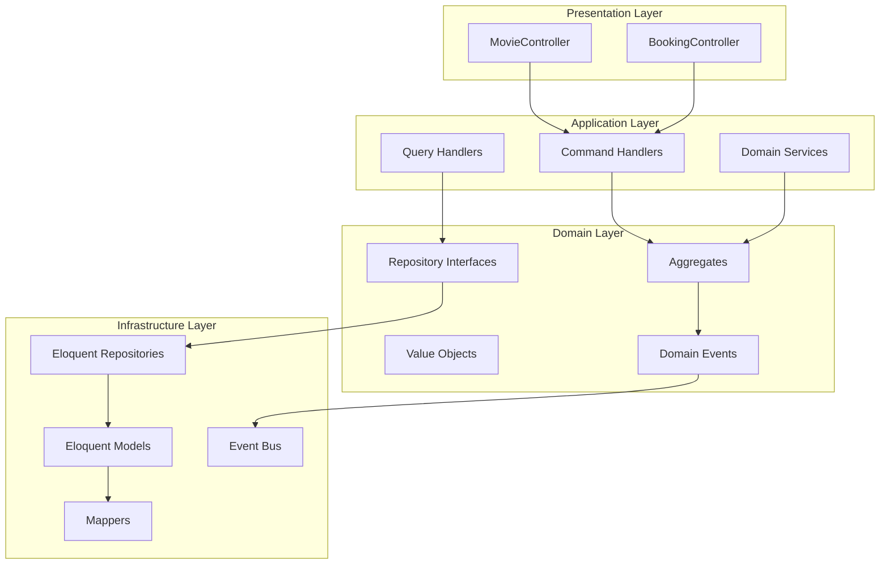

# Análisis DDD y Plan de Siguiente Etapa de Implementación

## 1. Análisis de la Estructura DDD General

### 1.1 Arquitectura de Capas

El proyecto implementa correctamente la arquitectura DDD con las siguientes capas:

```
app/
├── Domain/           # Capa de Dominio (reglas de negocio)
├── Application/      # Capa de Aplicación (casos de uso, CQRS)
├── Infrastructure/   # Capa de Infraestructura (persistencia, servicios externos)
└── Http/             # Capa de Presentación (controladores)
```

### 1.2 Bounded Contexts Identificados

| Contexto | Estado | Descripción |
|----------|--------|-------------|
| **Catalog** | ✅ Implementado | Gestión del catálogo de películas |
| **Booking** | ⚠️ Stub | Sistema de reservas de boletos |
| **Scheduling** | ⚠️ Stub | Programación de funciones |
| **Theater** | ⚠️ Stub | Gestión de salas y asientos |

### 1.3 Patrones DDD Implementados

- ✅ **Aggregate Root**: Movie como aggregate principal
- ✅ **Value Objects**: MovieId, Title, Plot, Rating, Image, ReleaseDate
- ✅ **Repository Pattern**: MovieRepository interface con implementación Eloquent
- ✅ **Factory Methods**: create() y reconstitute() en Movie
- ✅ **CQRS Básico**: Commands y Handlers separados
- ✅ **Mapper Pattern**: MovieMapper para conversión dominio/infraestructura
- ✅ **Domain Exceptions**: Excepciones específicas del dominio
- ✅ **Enums**: MovieStatus para estados de película

### 1.4 Patrones DDD No Implementados (Faltantes)

- ❌ **Domain Events**: No hay eventos de dominio publicados
- ❌ **Domain Services**: No hay servicios de dominio
- ❌ **Query Handlers**: No hay handlers para consultas (solo comandos)
- ❌ **Event Sourcing**: No implementado
- ❌ **Saga Pattern**: No implementado

---

## 2. Evaluación del Contexto Catalog

### 2.1 Componentes Implementados

#### Domain Layer
- **Aggregate Root**: [`Movie`](app/Domain/Catalog/Aggregates/Movie/Movie.php:39)
  - Factory methods: `create()`, `reconstitute()`
  - Métodos de negocio: `publish()`, `archive()`
  - Getters para todos los atributos
  
- **Value Objects**:
  - [`MovieId`](app/Domain/Catalog/ValueObjects/MovieId.php:18): Identificador único con validación
  - [`Title`](app/Domain/Catalog/ValueObjects/Title.php:19): Título con validación de longitud (max 255)
  - [`Plot`](app/Domain/Catalog/ValueObjects/Plot.php:19): Sinopsis con validación (max 500)
  - [`Rating`](app/Domain/Catalog/ValueObjects/Rating.php:19): Clasificación (G, PG, PG-13, R, NC-17)
  - [`Image`](app/Domain/Catalog/ValueObjects/Image.php:17): URL de imagen con validación de extensión
  - [`ReleaseDate`](app/Domain/Catalog/ValueObjects/ReleaseDate.php:16): Fecha de estreno inmutable

- **Enums**:
  - [`MovieStatus`](app/Domain/Catalog/Enums/MovieStatus.php:17): DRAFT, PUBLISHED, ARCHIVED

- **Exceptions**:
  - [`InvalidMovieStatus`](app/Domain/Catalog/Exceptions/InvalidMovieStatus.php:20)
  - [`InvalidMovieId`](app/Domain/Catalog/Exceptions/InvalidMovieId.php)
  - [`InvalidMovieTitle`](app/Domain/Catalog/Exceptions/InvalidMovieTitle.php)
  - [`InvalidMoviePlot`](app/Domain/Catalog/Exceptions/InvalidMoviePlot.php)
  - [`InvalidMovieRating`](app/Domain/Catalog/Exceptions/InvalidMovieRating.php)
  - [`InvalidMovieImage`](app/Domain/Catalog/Exceptions/InvalidMovieImage.php)

- **Repository Interface**:
  - [`MovieRepository`](app/Domain/Catalog/Repositories/MovieRepository.php:27): save, findById, delete, listByDateRange

#### Application Layer
- **Commands**:
  - [`CreateMovieCommand`](app/Application/Catalog/Movie/Commands/CreateMovieCommand.php:29): Crear película
  - [`PublishMovieCommand`](app/Application/Catalog/Movie/Commands/PublishMovieCommand.php): Publicar película
  - [`ArchiveMovieCommand`](app/Application/Catalog/Movie/Commands/ArchiveMovieCommand.php): Archivar película

- **Handlers**:
  - [`CreateMovieHandler`](app/Application/Catalog/Movie/Handlers/CreateMovieHandler.php:38): Procesa creación
  - [`PublishMovieHandler`](app/Application/Catalog/Movie/Handlers/PublishMovieHandler.php): Procesa publicación
  - [`ArchiveMovieHandler`](app/Application/Catalog/Movie/Handlers/ArchiveMovieHandler.php): Procesa archivado

#### Infrastructure Layer
- **Repository Implementation**:
  - [`EloquentMovieRepository`](app/Infrastructure/Persistence/Eloquent/Repositories/EloquentMovieRepository.php:27): Implementación Eloquent

- **Mapper**:
  - [`MovieMapper`](app/Infrastructure/Persistence/Mappers/MovieMapper.php:31): Conversión dominio ↔ infraestructura

- **Eloquent Model**:
  - [`MovieModel`](app/Infrastructure/Persistence/Eloquent/Models/MovieModel.php:24): Modelo de base de datos

#### Presentation Layer
- **Controller**:
  - [`MovieController`](app/Http/Controllers/Catalog/MovieController.php:15): Endpoints REST

### 2.2 Fortalezas del Contexto Catalog

1. **Separación clara de capas**: Domain no depende de Infrastructure
2. **Value Objects inmutables**: Todos los VOs son inmutables con validaciones
3. **Aggregate Root bien encapsulado**: Movie protege sus invariantes
4. **Repository Pattern**: Interface en Domain, implementación en Infrastructure
5. **CQRS básico**: Commands y Handlers separados
6. **Documentación excelente**: PHPDoc completo en todas las clases
7. **Excepciones específicas**: Cada tipo de error tiene su excepción
8. **Factory Methods**: create() y reconstitute() para creación controlada

### 2.3 Debilidades y Áreas de Mejora

1. **Falta Domain Events**:
   - No se publican eventos cuando cambia el estado de una película
   - Ejemplo: MoviePublished, MovieArchived, MovieCreated

2. **Falta Domain Services**:
   - No hay servicios de dominio para lógica compleja
   - Ejemplo: MovieCatalogService para búsquedas avanzadas

3. **Falta Query Handlers**:
   - Solo hay Command Handlers
   - No hay Query Handlers para lectura (GetMovieById, ListMovies, etc.)

4. **Validaciones limitadas**:
   - No se valida que una película archivada no pueda publicarse
   - No hay reglas de negocio complejas en el aggregate

5. **Falta Event Sourcing**:
   - No se mantiene historial de cambios
   - No se pueden reconstruir estados anteriores

6. **No hay tests**:
   - No se observan tests unitarios o de integración

7. **Repository incompleto**:
   - Falta método `findAll()` o `listAll()`
   - Falta método `findByStatus()`

---

## 3. Siguiente Etapa de Implementación

### 3.1 Fase 1: Completar Contexto Catalog (Prioridad Alta)

#### 3.1.1 Implementar Domain Events

**Archivos a crear:**
- `app/Domain/Catalog/Events/MovieCreated.php`
- `app/Domain/Catalog/Events/MoviePublished.php`
- `app/Domain/Catalog/Events/MovieArchived.php`
- `app/Domain/Shared/Events/DomainEvent.php` (base)

**Modificaciones:**
- [`Movie.php`](app/Domain/Catalog/Aggregates/Movie/Movie.php:39): Agregar colección de eventos
- [`Movie.php`](app/Domain/Catalog/Aggregates/Movie/Movie.php:51): Publicar evento en `create()`
- [`Movie.php`](app/Domain/Catalog/Aggregates/Movie/Movie.php:90): Publicar evento en `publish()`
- [`Movie.php`](app/Domain/Catalog/Aggregates/Movie/Movie.php:99): Publicar evento en `archive()`

#### 3.1.2 Implementar Query Handlers

**Archivos a crear:**
- `app/Application/Catalog/Movie/Queries/GetMovieByIdQuery.php`
- `app/Application/Catalog/Movie/Queries/ListMoviesQuery.php`
- `app/Application/Catalog/Movie/Queries/ListMoviesByStatusQuery.php`
- `app/Application/Catalog/Movie/Handlers/GetMovieByIdHandler.php`
- `app/Application/Catalog/Movie/Handlers/ListMoviesHandler.php`
- `app/Application/Catalog/Movie/DTOs/MovieDTO.php`

**Modificaciones:**
- [`MovieRepository.php`](app/Domain/Catalog/Repositories/MovieRepository.php:27): Agregar `findAll()`, `findByStatus()`
- [`EloquentMovieRepository.php`](app/Infrastructure/Persistence/Eloquent/Repositories/EloquentMovieRepository.php:27): Implementar nuevos métodos

#### 3.1.3 Mejorar Validaciones del Aggregate

**Modificaciones en [`Movie.php`](app/Domain/Catalog/Aggregates/Movie/Movie.php:39):**
- Validar que película archivada no pueda publicarse
- Validar que película publicada no pueda eliminarse
- Agregar método `canTransitionTo(MovieStatus $newStatus): bool`

#### 3.1.4 Implementar Domain Service

**Archivos a crear:**
- `app/Domain/Catalog/Services/MovieCatalogService.php`

**Responsabilidades:**
- Búsquedas avanzadas con múltiples criterios
- Validaciones de negocio complejas que involucran múltiples aggregates
- Lógica que no pertenece a un solo aggregate

#### 3.1.5 Agregar Tests Unitarios

**Archivos a crear:**
- `tests/Unit/Domain/Catalog/Aggregates/MovieTest.php`
- `tests/Unit/Domain/Catalog/ValueObjects/TitleTest.php`
- `tests/Unit/Domain/Catalog/ValueObjects/RatingTest.php`
- `tests/Unit/Application/Catalog/Movie/Handlers/CreateMovieHandlerTest.php`

### 3.2 Fase 2: Implementar Contexto Booking (Prioridad Alta)

#### 3.2.1 Implementar Aggregate Root Booking

**Archivos a modificar/crear:**
- [`Booking.php`](app/Domain/Booking/Aggregates/Booking/Booking.php:5): Implementar aggregate completo
- [`BookingId.php`](app/Domain/Booking/Aggregates/Booking/BookingId.php:5): Value Object para ID
- [`BookingStatus.php`](app/Domain/Booking/Aggregates/Booking/BookingStatus.php:5): Enum de estados
- [`Customer.php`](app/Domain/Booking/Aggregates/Booking/Customer.php): Value Object para cliente
- [`Ticket.php`](app/Domain/Booking/Aggregates/Booking/Ticket.php): Entity para boleto

**Estados de Booking:**
- PENDING: Reserva pendiente
- CONFIRMED: Reserva confirmada
- CANCELLED: Reserva cancelada
- EXPIRED: Reserva expirada

#### 3.2.2 Implementar Value Objects de Booking

**Archivos a crear:**
- `app/Domain/Booking/ValueObjects/BookingId.php`
- `app/Domain/Booking/ValueObjects/SeatNumber.php`
- `app/Domain/Booking/ValueObjects/Price.php`
- `app/Domain/Booking/ValueObjects/CustomerEmail.php`

#### 3.2.3 Implementar Domain Events de Booking

**Archivos a modificar:**
- [`BookingCreated.php`](app/Domain/Booking/Events/BookingCreated.php:5): Implementar evento
- [`BookingConfirmed.php`](app/Domain/Booking/Events/BookingConfirmed.php): Implementar evento
- [`BookingCancelled.php`](app/Domain/Booking/Events/BookingCancelled.php): Implementar evento
- [`SeatReserved.php`](app/Domain/Booking/Events/SeatReserved.php): Implementar evento

#### 3.2.4 Implementar Repository de Booking

**Archivos a modificar:**
- [`BookingRepository.php`](app/Domain/Booking/Repositories/BookingRepository.php:5): Definir interface

**Métodos necesarios:**
- `save(Booking $booking): void`
- `findById(BookingId $id): ?Booking`
- `findByCustomerEmail(string $email): array`
- `findPendingExpirations(): array`

#### 3.2.5 Implementar Application Layer de Booking

**Archivos a crear:**
- `app/Application/Booking/Commands/CreateBookingCommand.php`
- `app/Application/Booking/Commands/ConfirmBookingCommand.php`
- `app/Application/Booking/Commands/CancelBookingCommand.php`
- `app/Application/Booking/Handlers/CreateBookingHandler.php`
- `app/Application/Booking/Handlers/ConfirmBookingHandler.php`
- `app/Application/Booking/Handlers/CancelBookingHandler.php`

#### 3.2.6 Implementar Infrastructure Layer de Booking

**Archivos a crear:**
- `app/Infrastructure/Persistence/Eloquent/Models/BookingModel.php`
- `app/Infrastructure/Persistence/Eloquent/Repositories/EloquentBookingRepository.php`
- `app/Infrastructure/Persistence/Mappers/BookingMapper.php`

#### 3.2.7 Implementar Presentation Layer de Booking

**Archivos a crear:**
- `app/Http/Controllers/Booking/BookingController.php`

### 3.3 Fase 3: Implementar Contexto Scheduling (Prioridad Media)

#### 3.3.1 Implementar Aggregate Root Showtime

**Archivos a modificar:**
- [`Showtime.php`](app/Domain/Scheduling/Aggregates/Showtime/Showtime.php:5): Implementar aggregate
- [`ShowtimeId.php`](app/Domain/Scheduling/Aggregates/Showtime/ShowtimeId.php): Value Object
- [`ShowtimeStatus.php`](app/Domain/Scheduling/Aggregates/Showtime/ShowtimeStatus.php): Enum
- [`SeatAvailability.php`](app/Domain/Scheduling/Aggregates/Showtime/SeatAvailability.php): Entity

**Estados de Showtime:**
- SCHEDULED: Función programada
- AVAILABLE: Disponible para reservas
- SOLD_OUT: Agotado
- CANCELLED: Cancelado
- COMPLETED: Función completada

#### 3.3.2 Implementar Repository de Showtime

**Archivos a modificar:**
- [`ShowtimeRepository.php`](app/Domain/Scheduling/Repository/ShowtimeRepository.php): Definir interface

### 3.4 Fase 4: Implementar Contexto Theater (Prioridad Media)

#### 3.4.1 Implementar Aggregate Root Auditorium

**Archivos a modificar:**
- [`Auditorium.php`](app/Domain/Theater/Aggregates/Auditorium/Auditorium.php:5): Implementar aggregate
- [`AuditoriumId.php`](app/Domain/Theater/Aggregates/Auditorium/AuditoriumId.php): Value Object
- [`AuditoriumStatus.php`](app/Domain/Theater/Aggregates/Auditorium/AuditoriumStatus.php): Enum
- [`Seat.php`](app/Domain/Theater/Aggregates/Auditorium/Seat.php): Entity
- [`SeatNumber.php`](app/Domain/Theater/Aggregates/Auditorium/SeatNumber.php): Value Object

#### 3.4.2 Implementar Repository de Auditorium

**Archivos a modificar:**
- [`AuditoriumRepository.php`](app/Domain/Theater/Repositories/AuditoriumRepository.php): Definir interface

### 3.5 Fase 5: Integración y Event-Driven Architecture (Prioridad Baja)

#### 3.5.1 Implementar Event Bus

**Archivos a crear:**
- `app/Domain/Shared/Events/EventBus.php` (interface)
- `app/Infrastructure/Events/LaravelEventBus.php` (implementación)

#### 3.5.2 Implementar Event Handlers

**Archivos a crear:**
- `app/Application/Booking/EventHandlers/OnMoviePublishedHandler.php`
- `app/Application/Scheduling/EventHandlers/OnBookingConfirmedHandler.php`

#### 3.5.3 Implementar Saga Pattern

**Archivos a crear:**
- `app/Application/Booking/Sagas/BookingSaga.php`
- `app/Application/Booking/Sagas/BookingSagaState.php`

---

## 4. Diagrama de Arquitectura Propuesta



---

## 5. Priorización de Implementación

| Fase | Contexto | Prioridad | Tiempo Estimado | Dependencias |
|------|----------|-----------|-----------------|--------------|
| 1 | Catalog (mejoras) | Alta | 2-3 días | Ninguna |
| 2 | Booking | Alta | 4-5 días | Catalog completo |
| 3 | Scheduling | Media | 3-4 días | Booking completo |
| 4 | Theater | Media | 2-3 días | Ninguna |
| 5 | Integración | Baja | 3-4 días | Todos los contextos |

---

## 6. Recomendaciones Inmediatas

### 6.1 Para Catalog (Fase 1)

1. **Implementar Domain Events primero**:
   - Crear clase base `DomainEvent`
   - Crear eventos específicos: `MovieCreated`, `MoviePublished`, `MovieArchived`
   - Modificar `Movie` para publicar eventos

2. **Agregar Query Handlers**:
   - Crear `GetMovieByIdQuery` y `GetMovieByIdHandler`
   - Crear `ListMoviesQuery` y `ListMoviesHandler`
   - Agregar métodos al repositorio: `findAll()`, `findByStatus()`

3. **Mejorar validaciones**:
   - Agregar validación de transiciones de estado
   - Implementar `canTransitionTo()` en `Movie`

### 6.2 Para Booking (Fase 2)

1. **Definir aggregate completo**:
   - Implementar `Booking` con todos sus atributos
   - Definir estados y transiciones válidas
   - Implementar lógica de negocio (reservar, confirmar, cancelar)

2. **Implementar políticas de negocio**:
   - [`CancellationPolicy`](app/Domain/Booking/Policies/CancellationPolicy.php): Reglas de cancelación
   - [`ReservationPolicy`](app/Domain/Booking/Policies/ReservationPolicy.php): Reglas de reserva

3. **Implementar pricing**:
   - [`PriceCalculator`](app/Domain/Booking/Pricing/PriceCalculator.php): Calculador de precios
   - [`StandardPrice`](app/Domain/Booking/Pricing/StandardPrice.php): Precio estándar
   - [`PremiumPrice`](app/Domain/Booking/Pricing/PremiumPrice.php): Precio premium
   - [`PromotionalPrice`](app/Domain/Booking/Pricing/PromotionalPrice.php): Precio promocional

---

## 7. Conclusión

El proyecto tiene una **estructura DDD sólida** con el contexto **Catalog bien implementado**. La arquitectura de capas está correctamente separada y los patrones DDD fundamentales están presentes.

**Próximos pasos recomendados:**
1. Completar Catalog con Domain Events y Query Handlers
2. Implementar Booking como el siguiente bounded context
3. Agregar tests unitarios para garantizar calidad
4. Implementar Scheduling y Theater
5. Integrar todo con Event-Driven Architecture

La implementación progresiva garantiza que el sistema sea mantenible, escalable y siga los principios DDD.
